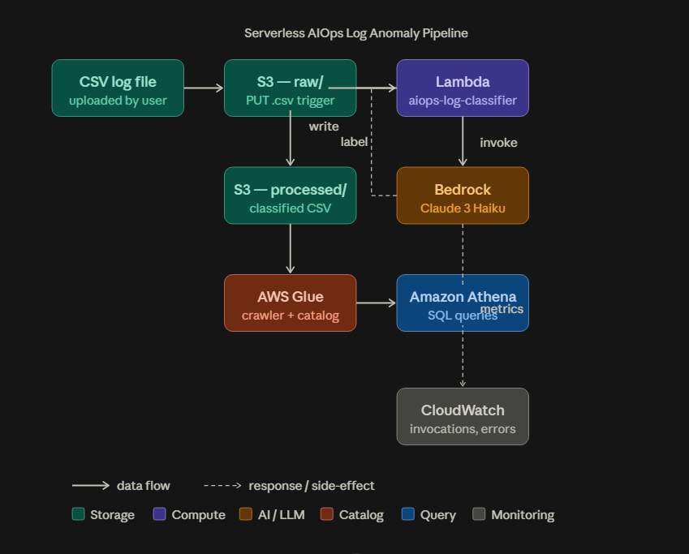
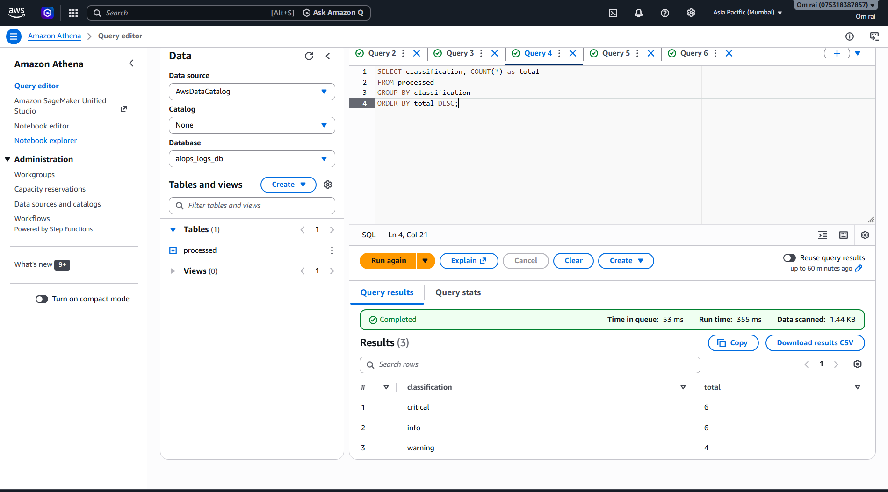
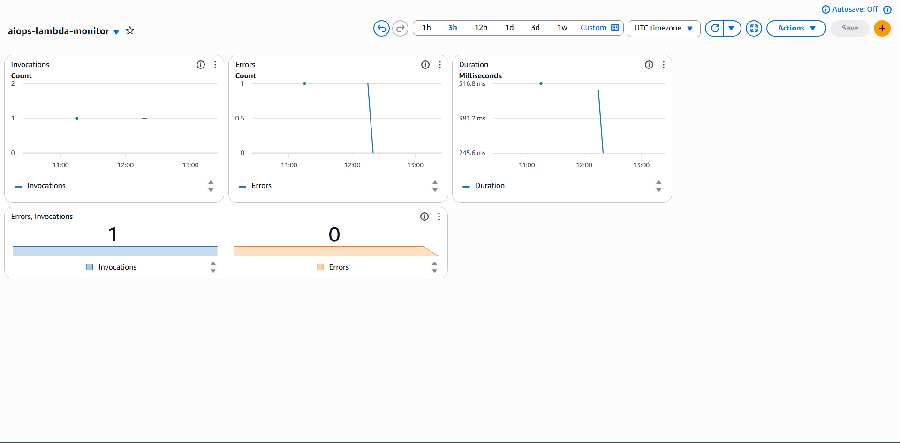

# AIOps Log Anomaly Pipeline

A fully serverless log anomaly detection pipeline on AWS that automatically classifies application logs as `critical`, `warning`, or `info` using AI.

## Architecture



## Stack

| Service | Role |
|---|---|
| **Amazon S3** | Stores raw logs (`raw/`) and classified output (`processed/`) |
| **AWS Lambda** | Triggered on S3 upload, classifies each log row |
| **Amazon Bedrock** | Runs Claude 3 Haiku to classify log messages |
| **AWS Glue** | Crawls `processed/` folder and catalogs schema |
| **Amazon Athena** | SQL queries over classified logs |
| **Amazon CloudWatch** | Monitors Lambda invocations, errors, and duration |

## How It Works

1. A CSV log file is uploaded to `s3://your-bucket/raw/`
2. S3 triggers Lambda automatically on PUT events
3. Lambda reads each row and calls Bedrock (Claude 3 Haiku) with a classification prompt
4. Each log is labeled: `critical`, `warning`, or `info`
5. Classified CSV is saved to `s3://your-bucket/processed/`
6. Glue Crawler runs on demand to catalog new files
7. Athena queries the data using SQL
8. CloudWatch tracks Lambda performance in real time

## Input Format

Upload a CSV to `raw/` with at least a `message` column:

```csv
timestamp,level,service,message
2024-01-15 10:01:00,ERROR,auth-service,Failed to connect to database after 5 retries
2024-01-15 10:02:00,INFO,api-gateway,User login successful for user_id 1042
2024-01-15 10:03:00,WARN,payment-service,Payment processing latency exceeded 3000ms threshold
```

## Output Format

Classified CSV saved to `processed/` with an added `classification` column:

```csv
timestamp,level,service,message,classification
2024-01-15 10:01:00,ERROR,auth-service,Failed to connect to database after 5 retries,critical
2024-01-15 10:02:00,INFO,api-gateway,User login successful for user_id 1042,info
2024-01-15 10:03:00,WARN,payment-service,Payment processing latency exceeded 3000ms threshold,warning
```

## Sample Athena Queries

```sql
-- Count logs by classification
SELECT classification, COUNT(*) as total
FROM processed
GROUP BY classification
ORDER BY total DESC;

-- Show only critical logs
SELECT timestamp, service, message
FROM processed
WHERE classification = 'critical';

-- Which service has the most critical logs?
SELECT service, COUNT(*) as critical_count
FROM processed
WHERE classification = 'critical'
GROUP BY service
ORDER BY critical_count DESC;
```

## Screenshots

### Athena — Log Classification Query


### CloudWatch — Lambda Monitoring Dashboard


## Setup Guide

### Prerequisites
- AWS account (free tier)
- Region: `ap-south-1` (or `us-east-1`)

### Step 1 — S3 Bucket
- Create bucket: `aiops-log-pipeline-[yourname]`
- Create folders: `raw/` and `processed/`

### Step 2 — IAM Role
- Create role: `aiops-lambda-role`
- Attach policies: `AmazonS3FullAccess`, `AmazonBedrockFullAccess`, `CloudWatchLogsFullAccess`, `AWSGlueServiceRole`
- Trust policy: Lambda + Glue

### Step 3 — Bedrock
- Enable Claude 3 Haiku model access in your region
- Model ID: `anthropic.claude-3-haiku-20240307-v1:0`

### Step 4 — Lambda
- Runtime: Python 3.12
- Role: `aiops-lambda-role`
- Timeout: 1 minute
- S3 trigger: PUT on `raw/*.csv`
- Code: see `lambda_function.py`

### Step 5 — Glue
- Create database: `aiops_logs_db`
- Create crawler: `aiops-log-crawler`
- Data source: `s3://your-bucket/processed/`
- Run crawler after uploading classified files

### Step 6 — Athena
- Set query result location: `s3://your-bucket/athena-results/`
- Select database: `aiops_logs_db`
- Query table: `processed`

### Step 7 — CloudWatch
- Dashboard: `aiops-lambda-monitor`
- Widgets: Invocations, Errors, Duration, Number summary

## Project Structure

```
AIOps-Log-Anomaly-Pipeline/
├── lambda_function.py       # Lambda handler + Bedrock classifier
├── sample_logs/
│   └── logs_test_01.csv     # Sample input CSV
└── README.md
```

## Key Learnings

- Event-driven serverless architecture using S3 → Lambda triggers
- LLM-based log classification using Amazon Bedrock (Claude 3 Haiku)
- Data lake querying with Glue + Athena (no database server needed)
- IAM trust policies for cross-service access (Lambda + Glue)
- CloudWatch monitoring for Lambda observability

## Author

Om Rai 
